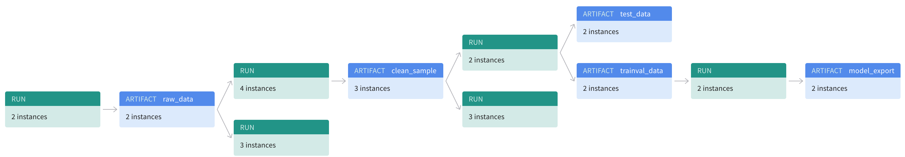

# Build an ML Pipeline for Short-Term Rental Prices in NYC

In this project, we will build end-to-end property rental price predictions using scikit-learn, MLflow and Weights & Biases. The project focuses on the MLops process, such as the tracking of experiments and pipeline artifacts.

## Table of contents

- [Local setup](#local-setup)
- [Cookie cutter](#cookie-cutter)
- [Running the pipeline](#running-the-pipeline)
  * [Entire pipeline](#entire-pipeline)
  * [Pipeline elements](#pipeline-elements)
  * [Pre-existing components](#pre-existing-components)
- [Visualize the pipeline](#visualize-the-pipeline)

## Local setup

- `git clone [REPO_URL]`
- `conda env create -f environment.yml`
- `conda activate nyc_airbnb_dev`

To run this pipeline, you need to have a "[wandb.ai](https://wandb.ai/authorize)" account and connect the CLI client to the service with the following:

- `wandb login [YOUR_API_KEY]`

wandb: Appending key for api.wandb.ai to your netrc file: /home/[your username]/.netrc

## Cookie cutter

This repo contains a cookie cutter template that you can use to add a new pipeline component.

Example use case

```bash
cookiecutter cookie-mlflow-step -o src

step_name [step_name]: basic_cleaning
script_name [run.py]: run.py
job_type [my_step]: basic_cleaning
short_description [My step]: This steps cleans the data
long_description [An example of a step using MLflow and Weights & Biases]: Performs basic cleaning on the data and save the results in Weights & Biases
parameters [parameter1,parameter2]: parameter1,parameter2,parameter3
```

The following command is used to use an individual component:

```bash
mlflow run src/basic_cleaning  \
                  -P parameter1=1 \
                   -P parameter2=2  \
                   -P parameter3="test"
```

## Running the pipeline

In section contains the example code to run the entire pipeline as well as running each section of the pipeline separately.

### Entire pipeline

- run the entire pipeline:

` mlflow run . `

- run the entire pipeline with hydra_options:

`mlflow run . -P hydra_options="etl.sample='sample2.csv'"`

```bash
mlflow run . \
  -P hydra_options="modeling.random_forest.n_estimators=10 etl.min_price=50"
```

### Pipeline elements


```bash
mlflow run . -P steps=download
```

If you want to run the ``download`` and the ``basic_cleaning`` steps, you can similarly do:

```bash
mlflow run . -P steps=download,basic_cleaning
```

```bash
mlflow run . \
  -P steps=download,basic_cleaning \
  -P hydra_options="modeling.random_forest.n_estimators=10 etl.min_price=50"
```

### The configuration
As usual, the parameters controlling the pipeline are defined in the ``config.yaml`` file defined in
the root of the starter kit. We will use Hydra to manage this configuration file. 
Open this file and get familiar with its content. Remember: this file is only read by the ``main.py`` script 
(i.e., the pipeline) and its content is
available with the ``go`` function in ``main.py`` as the ``config`` dictionary. For example,
the name of the project is contained in the ``project_name`` key under the ``main`` section in
the configuration file. It can be accessed from the ``go`` function as 
``config["main"]["project_name"]``.

NOTE: do NOT hardcode any parameter when writing the pipeline. All the parameters should be 
accessed from the configuration file.

### Running the entire pipeline or just a selection of steps
In order to run the pipeline when you are developing, you need to be in the root of the starter kit, 
then you can execute as usual:

```bash
>  mlflow run .
```

This will run the entire pipeline.

When developing it is useful to be able to run one step at the time. Say you want to run only
the ``download`` step. The `main.py` is written so that the steps are defined at the top of the file, in the 
``_steps`` list, and can be selected by using the `steps` parameter on the command line:


`mlflow run . -P steps=download`

If you want to run the ``download`` and the ``basic_cleaning`` steps, you can similarly do:

`mlflow run . -P steps=download,basic_cleaning`

You can override any other parameter in the configuration file using the Hydra syntax, by
providing it as a ``hydra_options`` parameter. For example, say that we want to set the parameter
modeling -> random_forest -> n_estimators to 10 and etl->min_price to 50:

```bash
> mlflow run . \
  -P steps=download,basic_cleaning \
  -P hydra_options="modeling.random_forest.n_estimators=10 etl.min_price=50"
```

### EDA

`mlflow run . -P steps=download`

### Data cleaning

`mlflow run . -P steps=basic_cleaning`


### Data testing

`mlflow run . -P steps="data_check"`

### Train Random Forest

```
mlflow run . \
         -P steps=train_random_forest
```

### Pre-existing components
In order to simulate a real-world situation, we are providing you with some pre-implemented
re-usable components. While you have a copy in your fork, you will be using them from the original
repository by accessing them through their GitHub link, like:

```python
_ = mlflow.run(
                f"{config['main']['components_repository']}/get_data",
                "main",
                parameters={
                    "sample": config["etl"]["sample"],
                    "artifact_name": "sample.csv",
                    "artifact_type": "raw_data",
                    "artifact_description": "Raw file as downloaded"
                },
            )
```
where `config['main']['components_repository']` is set to 
[https://github.com/udacity/build-ml-pipeline-for-short-term-rental-prices#components](https://github.com/udacity/build-ml-pipeline-for-short-term-rental-prices/tree/main/components).
You can see the parameters that they require by looking into their `MLproject` file:

- `get_data`: downloads the data. [MLproject](https://github.com/udacity/build-ml-pipeline-for-short-term-rental-prices/blob/main/components/get_data/MLproject)
- `train_val_test_split`: segrgate the data (splits the data) [MLproject](https://github.com/udacity/build-ml-pipeline-for-short-term-rental-prices/blob/main/components/train_val_test_split/MLproject)


### Visualize the pipeline

You can now go to W&B, go the Artifacts section, select the model export artifact then click on the
``Lineage` tab. You will see a representation of your pipeline.


set that are not in the proper geolocation. 

Then commit your change, make a new release (for example ``1.0.1``) and retry (of course you need to use 
``-v 1.0.1`` when calling mlflow this time). Now the run should succeed and voit la', 
you have trained your new model on the new data.

## License

[License](LICENSE.txt)